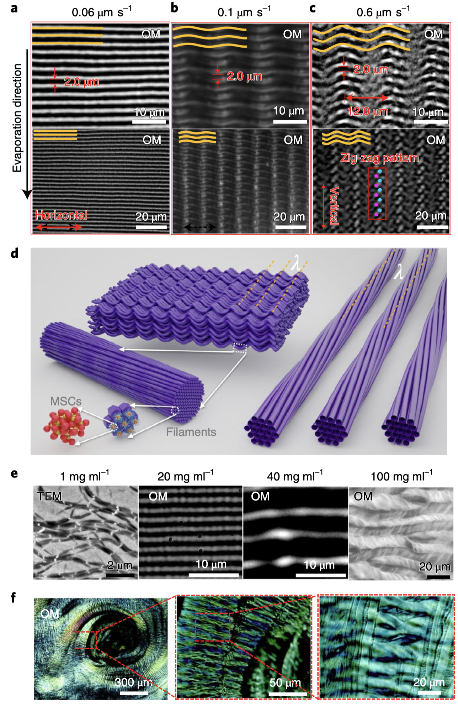
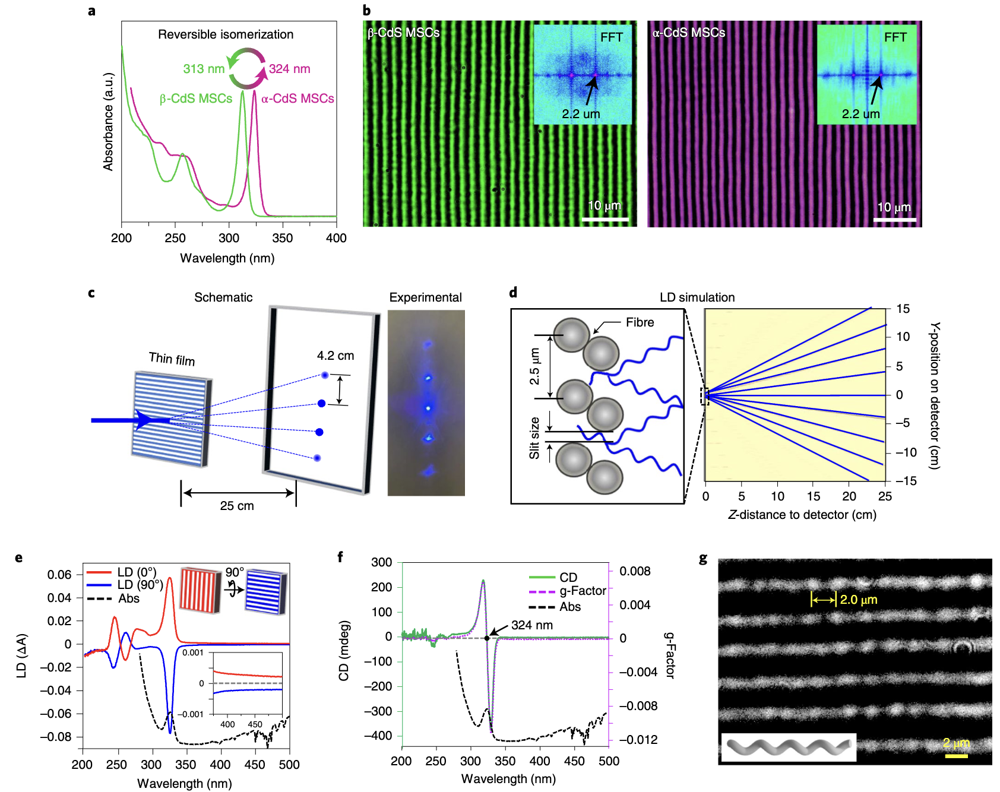
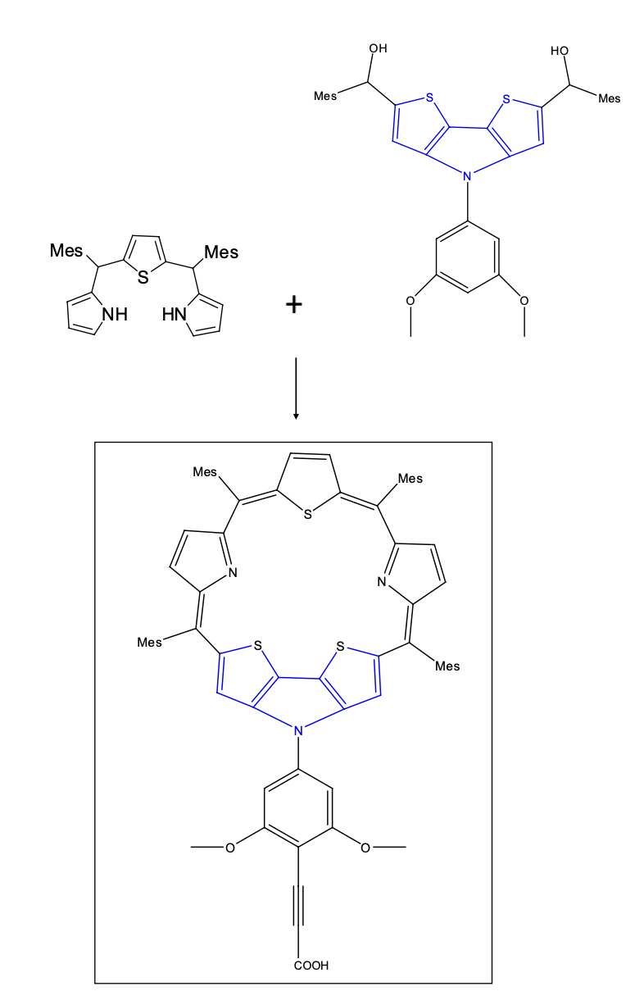
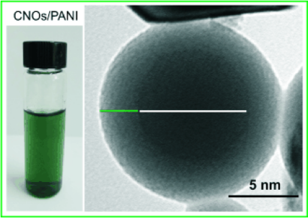

<i>Research portfolio:</i>

## 1. Background
### 1.1 About
Hello! It's nice to meet you. Thanks for taking the time to be here! 
I'm Shantanu Kallakuri, a recent graduate of <b>[Cornell University](https://en.wikipedia.org/wiki/Cornell_University)</b> and previously <b>[BITS Pilani](https://en.wikipedia.org/wiki/BITS_Pilani)</b>. I am presently a Senior Process Engineer at <b>[Applied Materials](https://en.wikipedia.org/wiki/Applied_Materials)</b> - Santa Clara, working on advancing Plasma-enhanced Atomic Layer Deposition <b>[(PE-ALD)](https://en.wikipedia.org/wiki/Atomic_layer_deposition)</b> for next-generation <b>[semiconductor nodes](https://en.wikipedia.org/wiki/List_of_semiconductor_scale_examples)</b> on <b>[emergent transistor devices](https://en.wikipedia.org/wiki/Multigate_device)</b> - the tiny little electrical switches that form the foundation of all modern electronics today. For further details on my research and interests please refer to my <a href="https://drive.google.com/file/d/17D313v9DqCLS0DZrB6lDNCNHgt3Lw_Jq/view?usp=sharing" title="CV" target="https://www.skallakuri.com/1_cv_resume"><b>CV</b></a>, <b>[publications](https://scholar.google.com/citations?user=sQuyU90AAAAJ&hl=en)</b>, <b>[patents](https://patents.google.com/?inventor=shantanu+kallakuri&oq=shantanu+kallakuri)</b>, and <b>[book chapter](https://www.appleacademicpress.com/functionalized-engineering-materials-and-their-applications-/9781771885232)</b>.
  

### 1.2 Governing Tenets
My research is deeply influenced by my personal values and interests. I love to build things - through synthesis, code, and simulation, am passionate about protecting the planet, and seek to leverage my knowledge and resources in developing systems that support society. Principles central to this approach I feel are energy efficiency, waste reduction, and sustainability. These motives have driven me to explore fields where I can apply my love for Chemistry, Physics, and Materials Science, particularly in synthesis and molecular design. Consequently, I am a strong proponent for scalable systems that minimize consumption and maximize utility. My past research has been strongly multi-disciplinary and I hope to continue along the same lines, since achieving these lofty objectives necessitates multidisciplinary science and engineering approaches so we can create comprehensive end-to-end material cycles and avoid a future filled with insidious materials like polythene (Plus it's more fun to do things together!). I thus seek to align my research in coherence with all these ideas.  

## 2. Applications
Research I am involved in has primarily been on: 
1) Energy-efficient electronic / optic / photonic devices 
2) Self-assembled fibers & thin-films with exotic properties like symmetry / chirality / magnetism 
3) Self-assembled fibers to remedy heavy-metals like Arsenic and Lead from groundwater 
4) Nanomotors for inexpensive point-of-care viral diagnostic microfluidic chips in developing nations & 
5) Dye sensitized solar cells and electron donor-acceptor systems

New research I constantly read and ideate about are an unending list in Chemistry, Physics and Biology. Of particular interest to me though are functional, scalable, programmable materials pertaining to semiconductors, computing, and energy that can be made using novel chemistry and materials science.
  

## 3. Design Principles
### 3.1 Bottom-up systems
One of my fundamental interests is in <b>[bottom-up](https://en.wikipedia.org/wiki/Nanomaterials#Bottom-up_methods)</b> materials chemistry approaches to help design and build <b>[larger functional materials](https://www.sciencedirect.com/topics/materials-science/functional-material)</b> from individual entities like <b>[atoms](https://en.wikipedia.org/wiki/Atom)</b> / <b>[quantum-dots](https://en.wikipedia.org/wiki/Quantum_dot)</b> / <b>[nanocrystals](https://en.wikipedia.org/wiki/Nanocrystalline_material)</b> / <b>[small molecules](https://doi.org/10.1021/acs.chemrev.2c00844)</b> / <b>[macro molecules](https://en.wikipedia.org/wiki/Macromolecule#Synthetic_macromolecules)</b> using methods that require minimal intervention i.e. <b>[molecular self-assembly](https://en.wikipedia.org/wiki/Molecular_self-assembly)</b> / <b>[directed self-assembly](https://en.wikipedia.org/wiki/Directed_assembly_of_micro-_and_nano-structures)</b> / <b>[amphiphilic self-assembly](https://pubs.acs.org/doi/10.1021/ar200226d)</b> / <b>[atomic layer deposition](https://en.wikipedia.org/wiki/Atomic_layer_deposition)</b> / <b>[chemical vapor deposition](https://en.wikipedia.org/wiki/Plasma-enhanced_chemical_vapor_deposition)</b> / <b>[click-chemistry](https://en.wikipedia.org/wiki/Click_chemistry)</b>. As most of these routes can be self-directed given the right conditions; atoms & molecules can be coerced to spontaneously assemble into anything we want them to, given the right conditions and only limited by our imagination. This ability to build, construct, and utilize materials is something I find fascinatingly boundless.
  

### 3.2 Practical Scalability

To be able to innovate, we need a translation of ideas and manufacturability. I see 1) <b>[high-speed devices](https://semiwiki.com/semiconductor-manufacturers/tsmc/339578-iedm-tsmc-ongoing-research-on-a-cfet-process/)</b> and <b>[low-power computing](https://en.wikipedia.org/wiki/Low-power_electronics)</b>, 2) <b>[spintronics](https://www.sciencedirect.com/science/article/pii/S0304885320302353)</b>, 3) <b>[quantum-dot cellular automata](https://en.wikipedia.org/wiki/Quantum_dot_cellular_automaton)</b>, 4) <b>[quantum automata for logic and memory](https://en.wikipedia.org/wiki/Quantum_cellular_automaton)</b>, and 5) <b>[photonic devices](https://en.wikipedia.org/wiki/Photonic_integrated_circuit)</b> as the main avenues that fit into this possibility. Reasons for this are multifold - these approaches have well-defined functionality, and massively amplify or enhance the properties of the individual entities they comprise of in a systematic, controllable manner - One that tends to be low-entropy with high surface / volume ratios as opposed to bulk materials which exhibit large disorder at all scales. This attribute increases efficiency, efficacy, and scalability of these properties and makes it possible to harness exotic properties (Like <b>[size-quantization](https://www.sciencedirect.com/topics/chemistry/quantum-size-effect#:~:text=Quantum%20size%20effect%20refers%20to,splitting%20or%20energy%20gap%20widening.)</b>, <b>[superconductivity](https://www.energy.gov/science/doe-explainssuperconductivity#:~:text=Superconductivity%20is%20the%20property%20of,transition%20to%20the%20superconducting%20state.)</b>, <b>[negative refractive index metamaterials](https://www.nature.com/articles/s41566-022-01137-1)</b>, and <b>[circular dichroism](https://www.pnas.org/doi/10.1073/pnas.93.23.12943)</b>).
  

### 3.3 Programmable matter
A closely related research interest of mine is the ability to <b>[program matter](https://en.wikipedia.org/wiki/Programmable_matter)</b> - utilizing artificial atoms such as <b>[nanoparticles](https://onlinelibrary.wiley.com/doi/10.1002/adma.202107875)</b> and <b>[quantum dots](https://doi.org/10.1126/science.aaz8541)</b> or individual atoms and molecules. This involves engineering molecules to create 'lego blocks' that <b>[interact with](https://pubs.acs.org/doi/full/10.1021/acs.jpcc.4c02012)</b>, <b>[correlate with](https://pubs.acs.org/doi/abs/10.1021/acs.chemmater.6b00623)</b>, or <b>[integrate into](https://www.nature.com/articles/nmat4576)</b> structures for specific purposes. Examples include <b>[superlattices](https://pubs.aip.org/avs/jva/article-abstract/30/3/030802/244536/Colloidal-nanocrystal-quantum-dot-assemblies-as)</b>, <b>[block copolymers](https://www.nature.com/articles/s41467-024-49839-0)</b>, <b>[coupled quantum-dots](https://pubs.acs.org/doi/abs/10.1021/acs.jpclett.7b00846)</b>, <b>[polymer brushes](https://pubs.acs.org/doi/abs/10.1021/jacs.4c06924)</b>, and <b>[programmable atom-equivalents](https://mirkin-group.northwestern.edu/project/programmable-nanomaterials/#:~:text=Unlike%20atomic%20systems%20in%20which,from%20the%20oligonucleotide%20%E2%80%9Cbonds%E2%80%9D%20)</b>. The natural ability of systems like <b>[natural photonic structures](https://www.nature.com/articles/nature01941)</b> in butterfly wings for example, and <b>[DNA](https://bio.libretexts.org/Courses/Portland_Community_College/Cascade_Microbiology/22%3A_Appendix_B_-_Molecular_Genetics_Review/22.2%3A_Structure_and_Function_of_DNA)</b>, where the <b>[nucleotides](https://en.wikipedia.org/wiki/Nucleotide)</b> operate in a sequential, countably limited manner, but generate stochastic process and unlimited hierarchical variants never ceases to amaze me.
  

### 3.4 Lowering consumption
The biggest problem we face today is undoubtedly uncontrolled <b>[consumption patterns](https://www.theworldcounts.com/challenges/climate-change/energy/global-energy-consumption)</b> and growing resource disparity that is exacerbated by population explosion. These cycles are only bound to snowball as population grows exponentially with <b>[no sustainable](https://ourworldindata.org/waste-management)</b> and quick way to reuse or recycle them. A good way to control this is to bring about awareness and education but given the time needed, massive number of people, complex geopolitics, fast fashion, fmcg, lower costs, and ineffective administration, there is no single authority that can implement this effectively. We will ultimately have to side-step this by engineering the materials themselves to either degrade and/or minimize the volume and energy needed for their function - Giving ourselves no choice but to have to degrade the materials after set times.  

<!--- 
<html>
   <head>
      <title>HTML Video embed</title>
   </head>
   <body>
      
Self-assembly of a coarse-grained lipid chain modelled on the magic-sized cluster

       
      <iframe width="480" height="350" src="../assets/video/self-assembly.mp4" frameborder="0" allowfullscreen></iframe>
      </iframe>
   </body>
</html>
-->

## 4. Details of past work
### 4.1 Research @ Cornell

<u>Advisors</u>: Prof. <b>[Richard Robinson](https://www.engineering.cornell.edu/faculty-directory/richard-douglas-robinson)</b> and Prof. <b>[Tobias Hanrath](https://www.cheme.cornell.edu/faculty-directory/tobias-hanrath)</b> 

My interests have led me to pursue an MS with <b>[thesis](https://ecommons.cornell.edu/items/81a31052-98cf-4e4b-986f-2acdd53f106e)</b> at Cornell advised by Prof. Richard Robinson & Prof. Tobias Hanrath where I developed <b>[‘Multiscale hierarchical structures from nanocluster mesophases'](https://www.nature.com/articles/s41563-022-01223-3.epdf?sharing_token=qK0xSPviChGM7xcUPUU6btRgN0jAjWel9jnR3ZoTv0Mlj6L1ihnKIvTL2i9xTkHG6BafGwraN4s7XjNhzTsCkpUcjwSzj93HbnbM7HvIOFPm7m36QhXGbSzyqOPUa8uVHx-UmEPV7zgdeEQzPG_aG1Vi1ErkWx6UOTxHYr54Jic%3D)</b>. This work has been covered to great depth in our recent <b>[Nature Materials](https://www.nature.com/articles/s41563-022-01223-3)</b> paper and in some news outlets that picked up on this work (<b>[Nature Press](https://www.nature.com/articles/s41563-022-01235-z) &#124; [Cornell News](https://news.cornell.edu/stories/2022/04/nanoclusters-self-organize-centimeter-scale-hierarchical-assemblies) &#124; [Phys.org](https://phys.org/news/2022-04-nanoclusters-self-organize-centimeter-scale-hierarchical.html) &#124; [Eurekalert](https://www.eurekalert.org/news-releases/950527) &#124; [Technology.org](https://www.technology.org/2022/04/17/nanoclusters-self-organize-hierarchy/) &#124; [Newswise](https://www.newswise.com/articles/nanoclusters-self-organize-into-centimeter-scale-hierarchical-assemblies) &#124; [Science News](https://sciencenewsnet.in/nanoclusters-self-organize-into-centimeter-scale-hierarchical-assemblies/) &#124; [Nanowerk](https://www.nanowerk.com/nanotechnology-news2/newsid=60396.php) &#124; [Science Springs](https://sciencesprings.wordpress.com/2022/04/14/from-the-cornell-chronicle-nanoclusters-self-organize-into-centimeter-scale-hierarchical-assemblies/) &#124; [NanoTech Now](https://www.nanotech-now.com/news.cgi?story_id=57033)</b>). Super excited to see this platform realize it's potential!
 

<b><u> 
Hierarchy of self-assembly of our magic-sized cluster quantum-dot system.</u><i> Images reprinted with permission from article journal and original authors. Citation: Nature Materials, 21(5): 518-525 (2022) : "Multiscale hierarchical structures from a nanocluster mesophase" H. Han, S. Kallakuri, Y. Yao, C. B. Williamson, D. R. Nevers, B. H. Savitzky, R. S. Skye, M. Xu, O. Voznyy, J. Dshemuchadse, L. F. Kourkoutis, S. J. Weinstein, T. Hanrath, R. D. Robinson</i></b>

 

<u>Link to MS thesis defense in case it is not viewable below:</u> <b>[Here](https://www.dropbox.com/scl/fi/kichd5dx01smrr645o9p8/MS-M-Exam-Thesis-Defense-Shantanu-Kallakuri.mp4?rlkey=tj8dmz8jkr6wdif9gjhp8qbqh&e=1&st=98ipu85m&dl=0)</b>

  <iframe width="700" height = "450" src="https://www.dropbox.com/scl/fi/kichd5dx01smrr645o9p8/MS-M-Exam-Thesis-Defense-Shantanu-Kallakuri.mp4?rlkey=tj8dmz8jkr6wdif9gjhp8qbqh&e=1&st=98ipu85m&dl=0"></iframe>

<u><a href="https://www.dropbox.com/scl/fi/kichd5dx01smrr645o9p8/MS-M-Exam-Thesis-Defense-Shantanu-Kallakuri.mp4?rlkey=tj8dmz8jkr6wdif9gjhp8qbqh&e=1&st=98ipu85m&dl=0" target="_blank"><b>Video: Final MS Thesis Defense at Cornell University on "Multiscale Hierarchical Structures from a Nanocluster Mesophase"</b></a></u>

<!--- https://www.dropbox.com/scl/fi/kichd5dx01smrr645o9p8/MS-M-Exam-Thesis-Defense-Shantanu-Kallakuri.mp4?rlkey=tj8dmz8jkr6wdif9gjhp8qbqh&st=98ipu85m&dl=0>

In this thesis my aim was to create a platform of scalable building blocks that could replicate nature's intricate self-assembly and order (as it beautifully happens in <b>[DNA](https://www.nature.com/articles/d41586-017-07690-y)</b>, <b>[Collagen](https://pubs.acs.org/doi/10.1021/la3048104)</b>, or <b>[photonic structures](https://www.nature.com/articles/nature01941)</b>  in butterfly wings) in a controlled and usable manner. While self-assembly is pretty common, creating macroscale structures from the atomic level is <b>[challenging](https://pubs.rsc.org/en/content/articlelanding/2022/nr/d1nr07814c)</b>, especially across the seven orders of magnitude (nanometer to centimeter), which we successfully achieved in Prof. Richard Robinson’s lab at Cornell. Postdoc Haixiang Han and I led the effort using basic lab chemicals instead of costly semiconductor equipment and lithography techniques, along with their analysis, characterization and simulation.

The key challenge was making a building block that could assemble seamlessly across all scales without disruptions caused by factors like <b>[solvent interactions](https://pubs.acs.org/doi/10.1021/jacs.0c09293)</b>, <b>[surface trap states](https://pubs.acs.org/doi/10.1021/acs.jpclett.7b02193)</b>, <b>[zeta potentials](https://www.sciencedirect.com/topics/pharmacology-toxicology-and-pharmaceutical-science/zeta-potential)</b>, or <b>[grain boundaries](https://www.sciencedirect.com/science/article/pii/S2451929420306586)</b> - all very prevalent in bulk materials. We used quantum dot magic-sized clusters (<1nm) bound with long-tailed lipid ligands to <b>[stabilize surface charge](https://pubs.acs.org/doi/10.1021/cm4000476)</b> and create self-assembling 'lego blocks'. By controlling the structure, functional group chemistry and size of these blocks we were able to create a simple one-pot method where these units self-spontaneously go on to form filamental wires that further auto-assemble into thicker ropes and ultimately into large thin films. The final films retained the individual dots' properties, like optical activity and chirality, with >99% purity and minimal loss.
  

<!--- 
<b><i>Hierarchical self-assembly of quantum-dot nanoparticles into defect-free thin-films</i></b>
 -->
<!--- <iframe width="480" height="350" src="../assets/video/self-assembly.mp4" frameborder="0" allowfullscreen></iframe>-->

 

<b><u> 
Optical, chiroptical, isomeric, and organizational properties of our MSC thin-films.</u><i> Images reprinted with permission from article journal and original authors. Citation: Nature Materials, 21(5): 518-525 (2022) : "Multiscale hierarchical structures from a nanocluster mesophase" H. Han, S. Kallakuri, Y. Yao, C. B. Williamson, D. R. Nevers, B. H. Savitzky, R. S. Skye, M. Xu, O. Voznyy, J. Dshemuchadse, L. F. Kourkoutis, S. J. Weinstein, T. Hanrath, R. D. Robinson</i></b>
 

<!--- <iframe width="480" height="350" src="../assets/video/self-assembly.mp4" frameborder="0" allowfullscreen></iframe>-->
<video width="580" height="450" controls allowfullscreen poster="../assets/images/pictures/SA.png">
  <source src="../assets/video/self-assembly.mp4" type="video/mp4" />
</video>

<b><u> 
Some MD simulations I had done on LAMPPS & Python with soft potentials to understand ordering of our QD magic-sized clusters.</u><i> Video used with permission from article journal and original authors. Citation: Nature Materials, 21(5): 518-525 (2022) : "Multiscale hierarchical structures from a nanocluster mesophase" H. Han, S. Kallakuri, Y. Yao, C. B. Williamson, D. R. Nevers, B. H. Savitzky, R. S. Skye, M. Xu, O. Voznyy, J. Dshemuchadse, L. F. Kourkoutis, S. J. Weinstein, T. Hanrath, R. D. Robinson</i></b>
 

### 4.2 Work @ MIT-DMSE
<u>Advisor</u>: Prof. <b>[Julia Ortony](https://dmse.mit.edu/faculty/julia-ortony/)</b>  
Designed and synthesized head-groups for the synthesis of self-assembling aramid amphiphiles to extract heavy-metals from groundwater. This work was accepted for the MRS Fall Meet, 2017, Boston, MA (Later withdrawn in order to patent the work). The molecules designed and synthesized here served as the initial prototypes and groundwork for future development continued in the following paper in <b>[Nature Nanotechnology: DOI - 10.1038/s41565-020-00840-w](https://doi.org/10.1038/s41565-020-00840-w)</b>  

### 4.3 Work @ HMS-BWH
<u>Advisor</u>: Prof. <b>[Hadi Shafiee](https://shafieelab.bwh.harvard.edu/people)</b> 

Designed & synthesized a catalytic Janus Pt/Au nanomotor system for cheap HIV/Zika microfluidic diagnostics. Used Thiol chemistry, Polymerase Chain Reaction (PCR), Loop-mediated isothermal DNA amplification (L.A.M.P.), & particle velocimetry. The microchip is 99% accurate and has been published in ACS nano and Nature communications.

<b> 
<u>Cellphone based point-of-care diagnostics using viral velocimetric techniques coupled with DNA amplification and virus-nanomotor coupling.</u><i> 1) Images reprinted with permission from article journal and original authors. Citation: ACS Nano, 12(6): 5709-5718 (2018) : "Motion-based immunological detection of Zika Virus using Pt-nanomotors and a cellphone" M. S. Draz, N. K. Lakshminaraasimulu, S. Krishnakumar, D. Battalapalli, A. Vasan, M. K. Kanakasabapathy, A. Sreeram, S. Kallakuri, P. Thirumalaraju, Y. Li, S. Hua, X. G. Yu, D. R. Kuritzkes, H. Shafiee</i></b>

<b><u>Catalytic Janus nanomotors for velocimetric diagnosis of HIV/Zika attached nanomotors vs unattached ones.</u><i> 2) Images reprinted with permission from article journal and original authors. Citation: Nature Communications, 9(1): 4282 (2018) : "DNA-engineered micromotors powered by metal nanoparticles for motion-based cellphone diagnostics" M. S. Draz, K. M. Kochehbyoki, A. Vasan, D. Battalapalli, A. Sreeram, M. K. Kanakasabapathy, S. Kallakuri, A. Tsibris, D. R. Kuritzkes, H. Shafiee</i></b>
 

### 4.4 Work @ CSIR-IICT
<u>Advisors</u>: Prof. <b>[Gokulnath Sabapathi](https://www.iisertvm.ac.in/faculty/gokul?%2Ffaculties%2Fgokul=)</b> and Prof. <b>[Giribabu Lingamallu](https://scholar.google.co.uk/citations?user=fIHcRIwAAAAJ&hl=en)</b> 

Bi-conjugated aromatic Porphyrin and Sapphyrin macro-cycles for Dye-sensitized solar cells - Designed and synthesized a donor-acceptor moiety designed for harnessing solar energy and conducting it through a dithienopyrrole acceptor onto a nanocrystalline TCO (Transparent conductive oxide) scaffold for use in Dye-sensitized solar cells. The entire system was an expanded Porphyrin moiety called Sapphyrin that utilized the alkene bond as a wire to transmit the harnessed photoelectrons to the scaffold to complete the photovolatic circuit.

<b><u> Novel Sapphyrin-Dithienopyrrole based photosensitizer for dye-sensitized solar cells</u><i> 1) Images reprinted with permission from article journal and original authors. Citation: Thesis: Kallakuri. S, "Expanded Porphyrin - Dithienopyrrole based efficient dye sensitized solar cells - design, synthesis and fabrication"</i></b>

 

### 4.5 UG Work @ BITS-Pilani
<u>Advisor</u>: Prof. <b>[Jayanty Subbalakshmi](https://www.bits-pilani.ac.in/hyderabad/jayanty-subbalakshmi/)</b> 

Design and synthesis of templated Polyanilines - A new class of conductive polymeric materials. Our goal here was to create structures that are both conductive and do not have the amorphous nature or brittleness that polymers typically exhibit. We were able to achieve this using synthetic additions to help bind and crystallize the polymer in blocks allowing for easy application of conductive materials, as observed in the SEM images below. 

<b><u> Conductive Polyaniline grafted with a) Trisodium citrate b) PEDOT-PSS c) PEG</u><i> 1) Images reprinted with permission from article journal and original authors. Citation: Thesis: Kallakuri. S, "Design and synthesis of templated Polyanilines - A new class of conductive polymeric materials"</i></b>

 

### 4.6 UG Work 2 @ BITS-Pilani
<u>Advisor</u>: Prof. <b>[Ramesh Babu Adusumalli](https://universe.bits-pilani.ac.in/Hyderabad/rameshbabu/Profile)</b> 

This study was focused on understanding chemical changes to lignin and wood-pulp morphology when they undergo cooking and bleaching through a Kraft process. 

<!---

    

<li class="mainmenu-line">  <a href="Guide_to_Metallurgy" title="Guide to Metallurgy"><b>Metallurgy</b></a> </li>

# Chemystery
# Covid Relief Resources
# Gallery
# Upcoming
# List of reagents
# Semiconductor Basics
# List of python commands
# Simple Python & VBA exercises
## What is this?
## Vankay Puls
### SubSubLevel-->