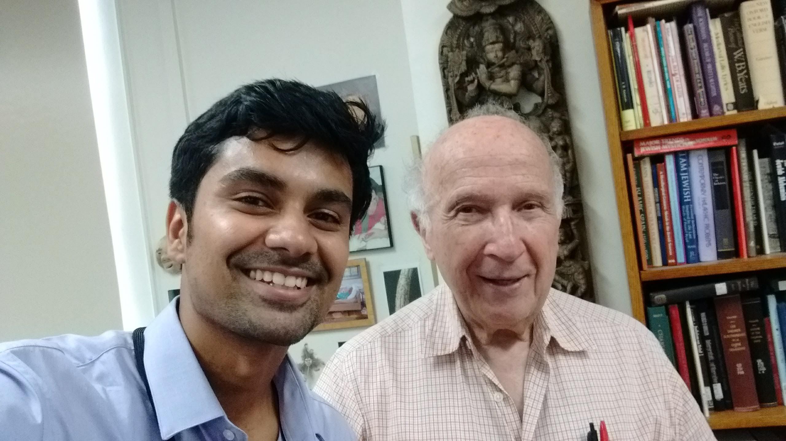
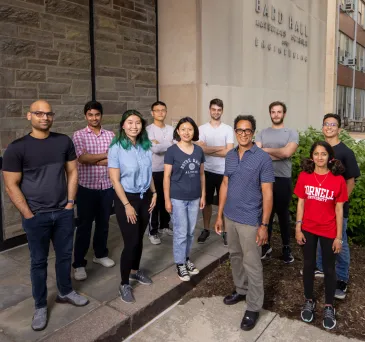
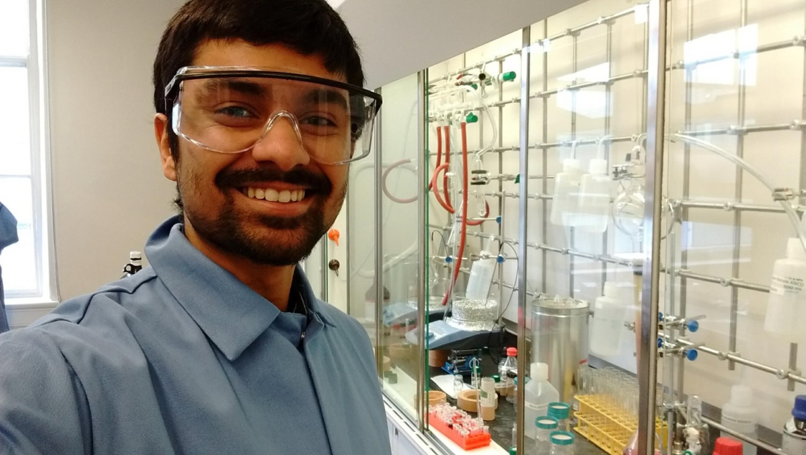
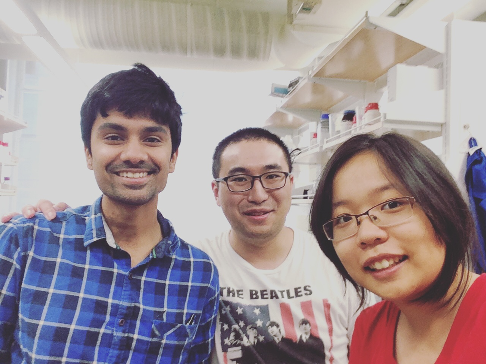
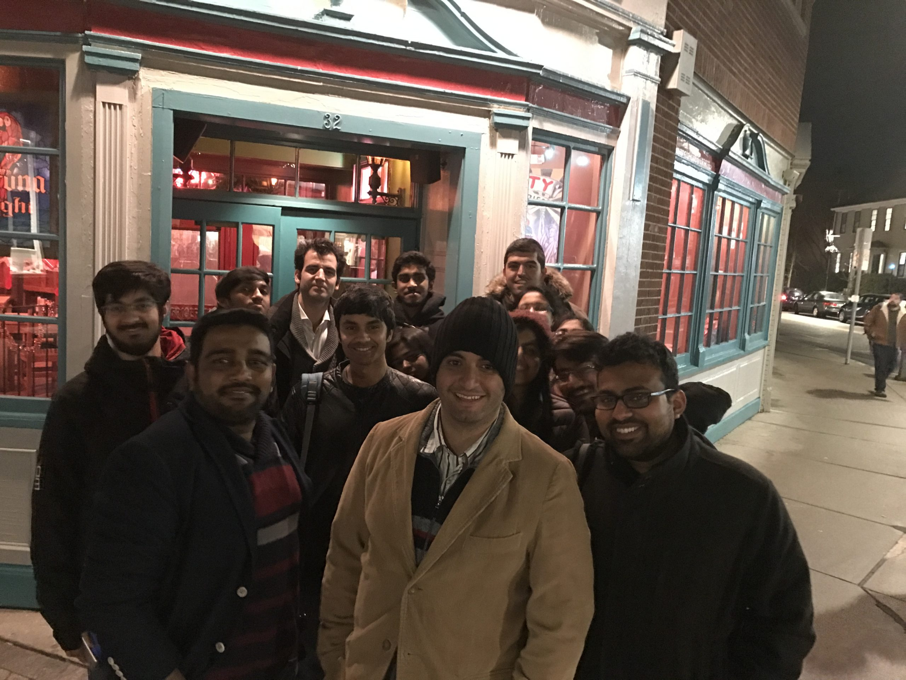
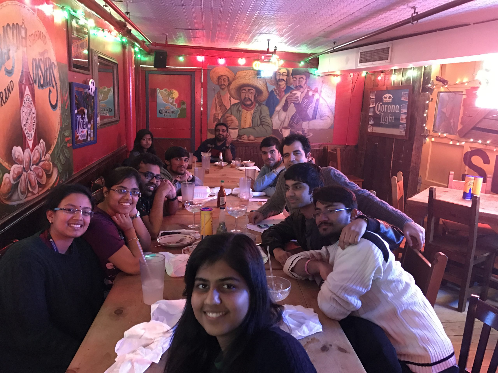

<i>Photo Gallery:</i>

### Preface: My Chemistry Inspirations:
Prof. Roald Hoffman: He is an amazing person, who has seen so much life, carved his own path and influenced the entire field of chemistry. He is such an inspiration from when I was a school student studying about named Hoffman reactions. I really loved how open he was to mentoring students and loved spending time with him talking about ancient sculptures and temples in Mahabaleshwar.

Prof. Paul Alivisatos: He is such an amazing mentor, I personally know so many including my research advisor who were mentored by him. And the amount of contributions he has made to the field of materials science, especially nanotechnology is so incredible and touches so many facets in life. Really loved our short and sweet conversation about the future of nanoscience and upcoming areas.

### 1. Robinson Lab Sojourns
Department of Materials Science and Engineering, Cornell University

The Team
L to R : Front: Anuj Bhargava, Quynh Phuong, Mengyu Xu, Prof. Richard Robinson, Monona Khare
Back: Shantanu Kallakuri, Frank Yao, Matthew Dykes, Jonathan Rowell, Eduardo Barriera  

In my element  

### 2. Ortony Lab Sojourns
Department of Materials Science and Engineering, MIT

The Team, Part 1.
L to R : Jia Tian, Shantanu Kallakuri, Prof. Julia Ortony, and William Robin Lindemann

The Team, Part 2.
L to R : A guy right after his successful braces course, Jia Tian, Cynthia Lo

The Team, Part 3.
L to R : William Robin Lindemann, Molly Parsons, Cynthia Lo, Jia Tian, Hasumi Tian, Madhuri Dhariwal, and a clueless person in quarter-life crisis

### 3. Shafiee Lab Sojourns
Brigham and Women's Hospital, Harvard Medical School

Being foodly, is the noblest virtue.
L to R: Anish Vasan, Vinish Yogesh, Dr. Hadi Shafiee, a guy struggling to smile in his sweaty leather jacket, Aradana Muthupandian, Prudhvi Nandan, Babak Safavieh, Shreya Kumar, Tanmaye Nallan, Kamyar Mehrabi, Manjyot Kaur, Rishabh Singh, Manoj Kumar

Smells like Team spirit.
L to R: Tanmaye Nallan, Manjyot Kaur, Manoj Kumar, Vinish Yogesh,, Aradana Muthupandian, Shreya Kumar, Hardik Pandya, Kamyar Mehrabi, Dr. Hadi Shafiee, a hungry chap staring at the food on the wall, Rishabh Singh