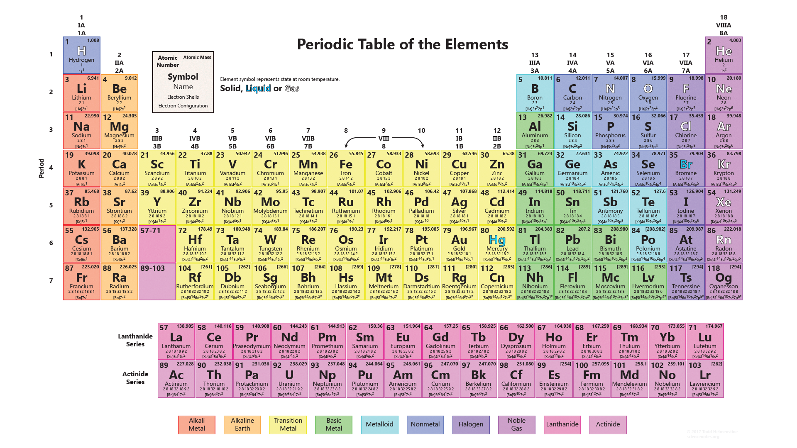

### The Amazing Periodic Table

 Here is the amazing periodic table for reference if needed. It contains Atomic numbers, Mass numbers, Electron shells and Electronic configurations. <u><i>Credits</i></u>: The image is sourced from a non-copyright free-for-use website called sciencenotes.org.

