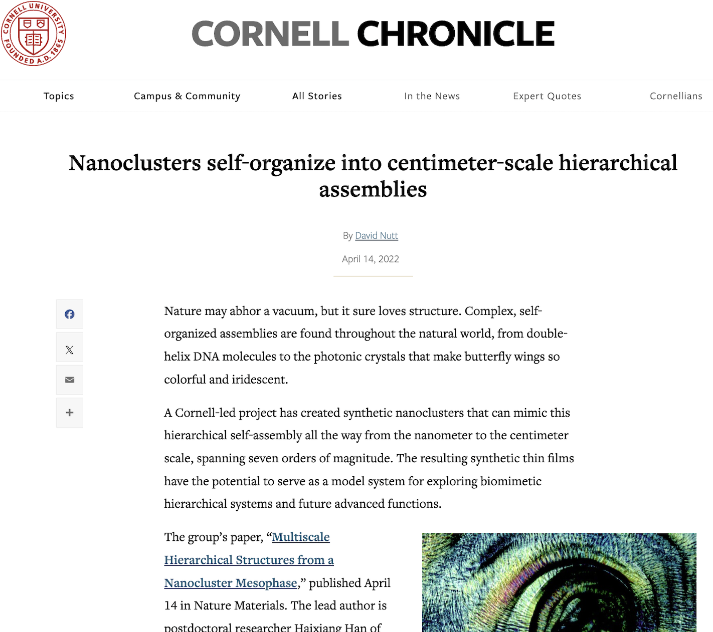
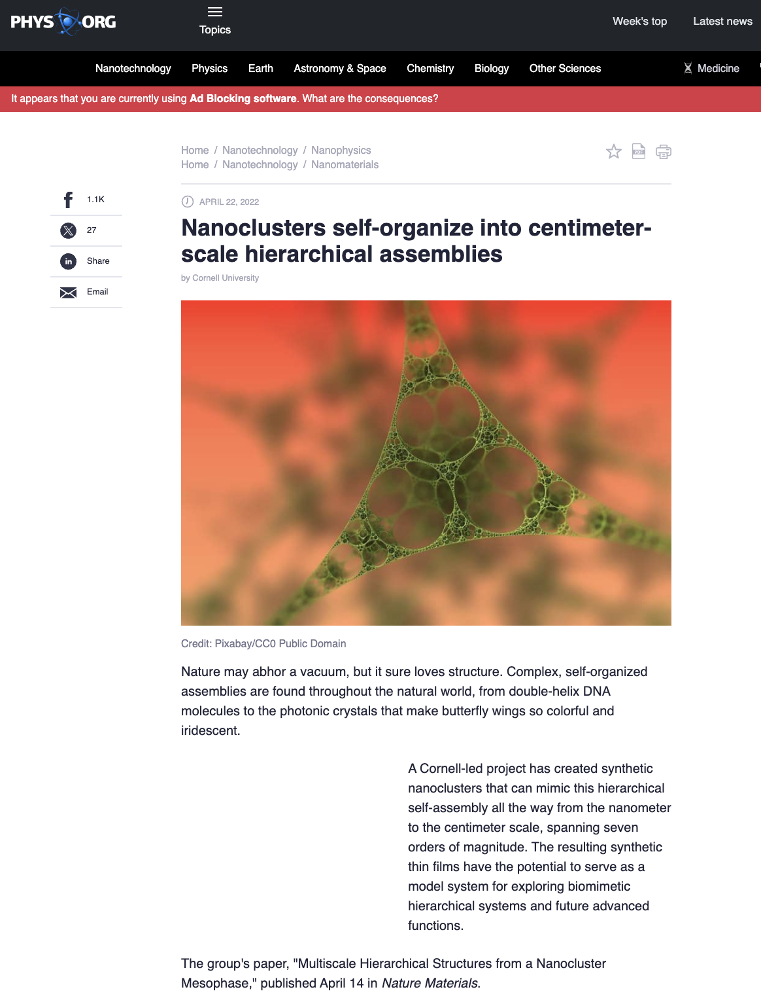
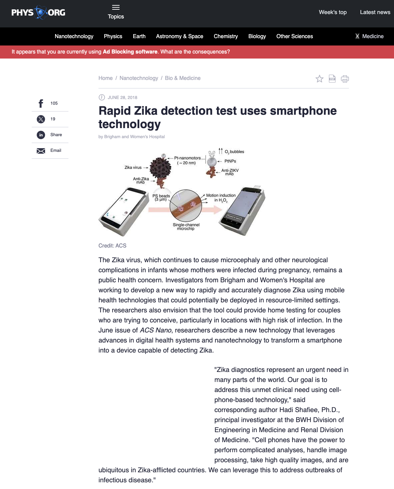
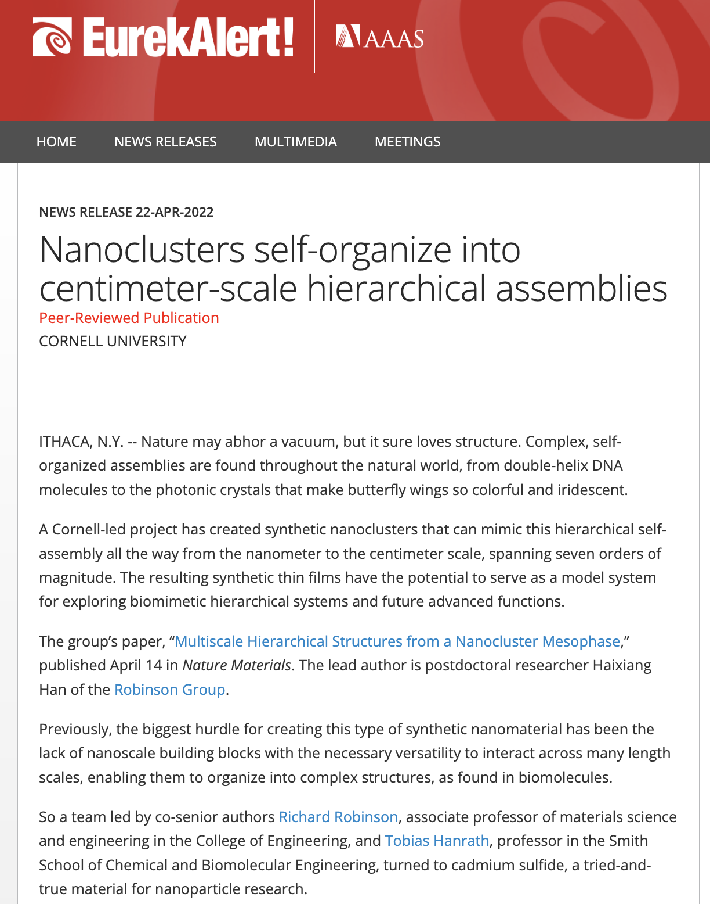

<i>Work in the media:</i>

### <b><i>[Nature News & Views](https://doi.org/10.1038/s41563-022-01235-z)</i  ></b>

<b>
Source: Bishop, K. M. Nature News and Views (2022)</b>
 

### <b><i>[Cornell Chronicle](https://news.cornell.edu/stories/2022/04/nanoclusters-self-organize-centimeter-scale-hierarchical-assemblies)</i></b>

<b>
Source: Nutt, D. Cornell Chronicle (2022)</b>
 

### <b><i>[Phys.org 1](https://phys.org/news/2022-04-nanoclusters-self-organize-centimeter-scale-hierarchical.html)</i></b>

<b>
Source: Editorial board, Phys.org (2022)</b>
 

### <b><i>[Phys.org 2](https://phys.org/news/2018-06-rapid-zika-smartphone-technology.html)</i></b>

<b>
Source: Editorial board, Phys.org (2018)</b>
 

### <b><i>[Eurekalert.org](https://www.eurekalert.org/news-releases/950527)</i></b>

<b>
Source: Editorial board, Eurekalert (2022)</b>
 

### <b><i>[Eurekalert.org 2](https://www.eurekalert.org/news-releases/737400)</i></b>

<b>
Source: Editorial board, Eurekalert (2018)</b>
 

### <b><i>[Singularity Hub](https://singularityhub.com/2018/12/07/a-smartphone-app-and-3d-printed-attachment-for-hiv-detection/)</i></b>

<b>
Source: Pring-Mill, D. Singularity Hub (2018)</b>
 

### <b><i>[Technology.org](https://www.technology.org/2022/04/17/nanoclusters-self-organize-hierarchy/)</i></b>

<b>
Source: Editorial board, Technology.org (2022)</b>
 

### <b><i>[Newswise.com](https://www.newswise.com/articles/nanoclusters-self-organize-into-centimeter-scale-hierarchical-assemblies)</i></b>

<b>
Source: Editorial board, Newswise (2022)</b>
 

### <b><i>[Science News](https://sciencenewsnet.in/nanoclusters-self-organize-into-centimeter-scale-hierarchical-assemblies/)</i></b>

<b>
Source: Editorial board, Science News.Net (2022)</b>
 

### <b><i>[Nanowerk 1](https://www.nanowerk.com/nanotechnology-news2/newsid=60396.php)</i></b>

<b>
Source: Editorial board, Nanowerk.com (2022)</b>
 

### <b><i>[Nanowerk 2](https://www.nanowerk.com/nanotechnology-news2/newsid=51457.php)</i></b>

<b>
Source: Editorial board, Nanowerk.com (2018)</b>
 

### <b><i>[Science Springs](https://sciencesprings.wordpress.com/2022/04/14/from-the-cornell-chronicle-nanoclusters-self-organize-into-centimeter-scale-hierarchical-assemblies/)</i></b>

<b>
Source: Editorial board, Science Springs (2022)</b>
 

### <b><i>[Medical Express](https://medicalxpress.com/news/2018-11-cellphone-technology-hiv.html?src_id=alt)</i></b>

<b>
Source: Editorial board, Medical Xpress (2018)</b>
 