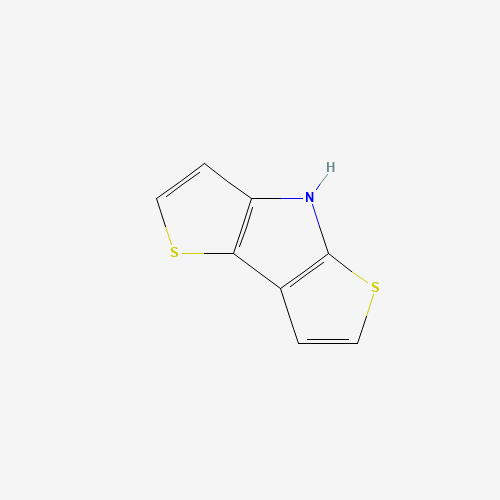
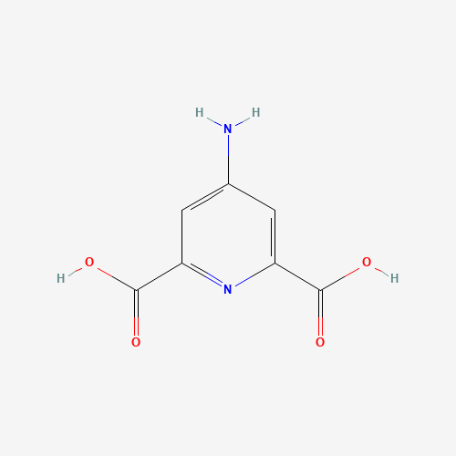
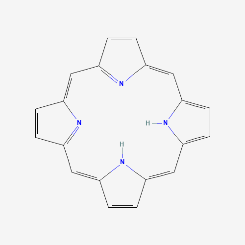
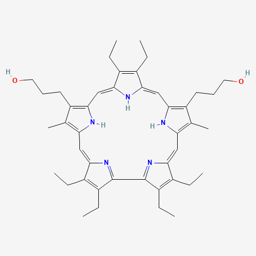

Page updated regularly with new molecules.

<u><b>Abbreviations: </b></u>
EDG = Electron donating group 
EWG = Electron withdrawing group 

## List of organic molecules
### Nitrogen-based Molecules

<table>
<tr>
<th>Molecule</th>
<th>Molecular Weight</th>
<th>Active Functional Group</th>
<th>Mol. Wt.</th>
<th>Stable in air?</th>
<th>Possible Uses</th>
</tr>
<tr>
<td><a href="https://pubchem.ncbi.nlm.nih.gov/compound/Dithienopyrrole" target="_blank"><b>Dithienopyrrole</b></a></td>
<td>

</td>
<td>Amine and Thiol units</td>
<td></td>
<td></td>
<td>Excellent electron donor</td>
</tr>
<tr>
<td><a href="https://pubchem.ncbi.nlm.nih.gov/compound/4-Aminopyridine-2_6-dicarboxylic-acid" target="_blank"><b>4-Aminopyridine-2,6-dicarboxylic acid</b></a></td>
<td>

</td>
<td>Amine, Pyridine, Acid groups</td>
<td></td>
<td></td>
<td>Has both EDG and EWG</td>
</tr>
<tr>
<td><a href="https://pubchem.ncbi.nlm.nih.gov/compound/Porphyrin" target="_blank"><b>Porphyrin</b></a></td>
<td>

</td>
<td>Primarily pyrrole or Nitrogen groups</td>
<td></td>
<td></td>
<td>Has mainly both EDG and EWG at alpha and beta pyrrole positions</td>
</tr>
<tr>
<td><a href="https://pubchem.ncbi.nlm.nih.gov/compound/9939831#section=2D-Structure" target="_blank"><b>Sapphyrin</b></a></td>
<td>
<!---   -->

</td>
<td>Primarily pyrrole or Nitrogen groups</td>
<td></td>
<td></td>
<td>Has mainly both EDG and EWG at alpha and beta pyrrole positions</td>
</tr>
</table>

### Sulfur-based Molecules

### Oxygen-based Molecules

## List of inorganic molecules
### 
