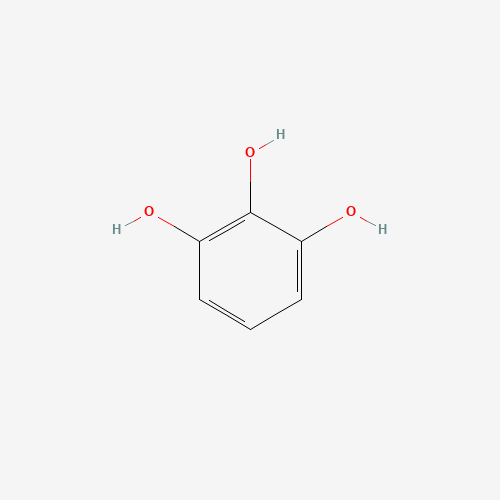

<i>A reagent and catalyst list for synthesis:</i>

Here's a list of useful reagents and catalysts in organic and inorganic synthesis and a list of ways to interconvert between different functional groups. This list, just like the previous one is infinite but I hope to preserve a useful record and keep it expanding. Watch out for this space!

<u><b>Abbreviations: </b></u>
EDG = Electron donating group 
EWG = Electron withdrawing group 

## List of organic molecules
### Nitrogen-based Molecules

<table>
<tr>
<th>Molecule</th>
<th>Molecular Weight</th>
<th>Active Functional Group</th>
<th>Mol. Wt.</th>
<th>Stable in air?</th>
<th>Where & when can it be used?</th>
</tr>   
<tr>
<td><a href="https://pubchem.ncbi.nlm.nih.gov/compound/Pyrogallol" target="_blank"><b>Pyrogallol</b></a></td>
<td>

</td>
<td></td>
<td></td>
<td></td>
<td></td>
</tr>
<tr>
<td><a href="https://pubchem.ncbi.nlm.nih.gov/compound/Schiff-base" target="_blank"><b>Schiff base</b></a></td>
<td>

</td>
<td></td>
<td></td>
<td></td>
<td></td>
</tr>
<tr>
<td><a href="https://pubchem.ncbi.nlm.nih.gov/compound/Eaton_s-Reagent#section=2D-Structure" target="_blank"><b>Eaton's reagent</b></a></td>
<td>

</td>
<td></td>
<td></td>
<td></td>
<td></td>
</tr>
<tr>
<td><a href="https://pubchem.ncbi.nlm.nih.gov/compound/Fenton_s-reagent#section=2D-Structure" target="_blank"><b>Fenton's reagent</b></a></td>
<td>
<!---   -->

</td>
<td></td>
<td></td>
<td></td>
<td></td>
</tr>
</table>

### Sulfur-based Molecules

### Oxygen-based Molecules

## List of inorganic molecules
### 
