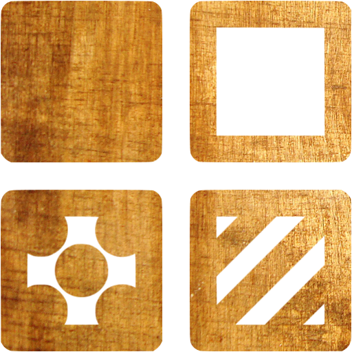
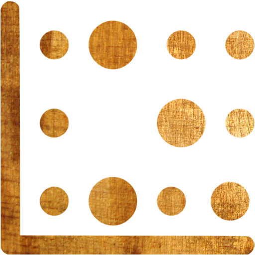

 Hi, thanks for visiting! I'm Shantanu Kallakuri and this page is my website, where I love to write on various topics. This site is a personal endeavor dedicated to popularizing easy science with emphasis on Materials Chemistry and their incredible applications in nature. After all, Chemistry's what makes for a great cup of coffee and some classy romance! Let's dive in:

 

<!--- 
 &nbsp; <b>Site Content</b>
 -->

My Research and background:

<li class="mainmenu-line">  <a href="0_research_portfolio" title="research portfolio"><b>Research Portfolio</b></a> </li>

<li class="mainmenu-line">  <a href="1_cv_resume" title="cv and resume"><b>CV / Resume</b></a> </li>

<li class="mainmenu-line">  <a href="2_publications_patents" title="publications and patents"><b>Publications  and patents</b></a> </li>

<li class="mainmenu-line">  <a href="3_in_the_media" title="in the media"><b>Work in the media</b></a> </li>

<li class="mainmenu-line">  <a href="4_contact" title="Contact"><b>Contact me</b></a> </li>

<!---
<li class="mainmenu-line">  <a href="5_mission_and_scientific_philosophy" title="mission and scientific philosophy"><b>Mission and philosophy</b></a> </li>  
-->

<li class="mainmenu-line">  <a href="5_modelling_simulation_and_code" title="modelling, simulation and code"><b>Modelling, Simulation, Code</b></a> </li>  

Everything to do with Electrons and Photons:

<li class="mainmenu-line">  <a href="6_database_of_interesting_molecules" title="database of interesting molecules"><b>Database of novel molecules</b></a> </li>

<li class="mainmenu-line">  <a href="7_reagent_list_for_synthesis" title="reagent list for synthesis"><b>Reagent lists for synthesis</b></a> </li>

<li class="mainmenu-line">  <a href="8_list_of_techniques" title="List of techniques"><b>List of tools  and techniques</b></a> </li>

<li class="mainmenu-line">  <a href="9_interesting_science_papers" title="interesting papers"><b>Interesting science papers</b></a> </li>

<li class="mainmenu-line">  <a href="10_science_of_semiconductors" title="science of semiconductors"><b>The science of semiconductors</b></a> </li>

<li class="mainmenu-line">  <a href="11_em_optics_and_photonics" title="em optics and photonics"><b>E.M., Optics, & Photonics</b></a> </li>  

Outreach and more:

<li class="mainmenu-line">  <a href="13_resources_for_the_afflicted" title="resources for the afflicted"><b>Resources for covid-afflicted</b></a> </li>

<li class="mainmenu-line">  <a href="12_photo_gallery" title="photo gallery"><b>Photo gallery</b></a> </li>

<li class="mainmenu-line">  <a href="14_the_amazing_periodic_table" title="the amazing periodic table"><b>The Amazing Periodic Table</b></a> </li>

<!---
<li class="mainmenu-line">  <a href="13_outreach" title="outreach"><b>Outreach Activities</b></a> </li>

<li class="mainmenu-line">  <a href="Guide_to_Metallurgy" title="Guide to Metallurgy"><b>How It's Made</b></a> </li>-->

