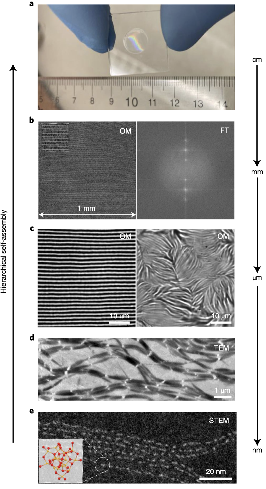
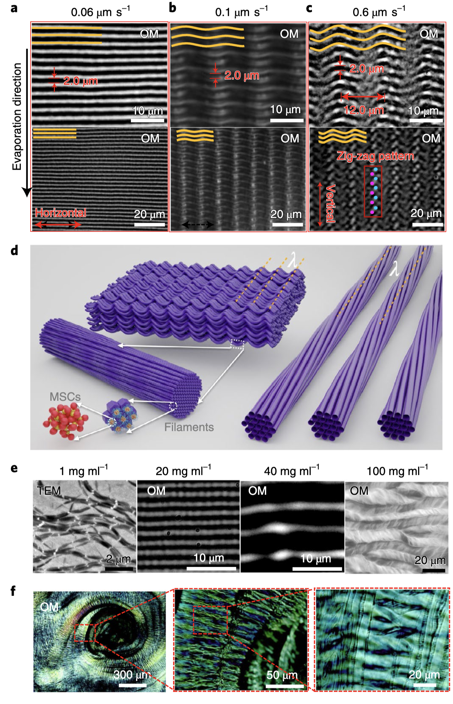
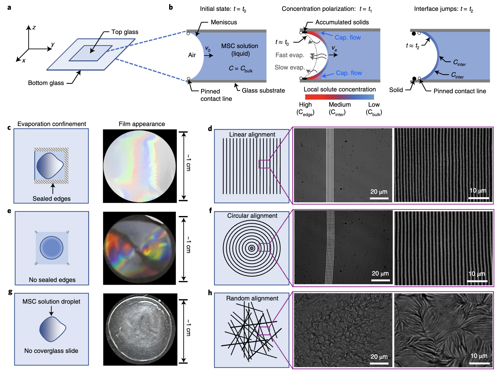
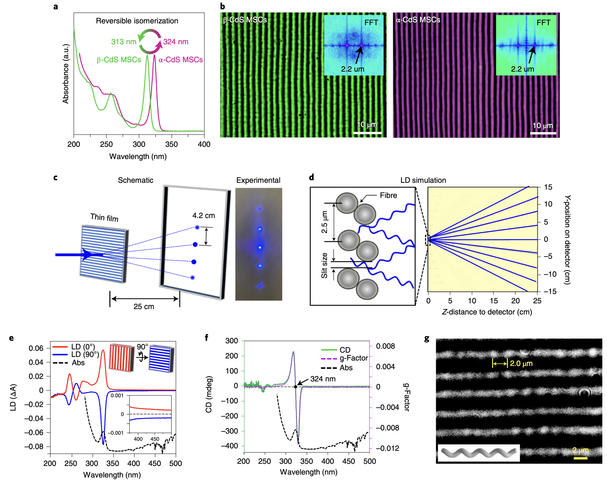
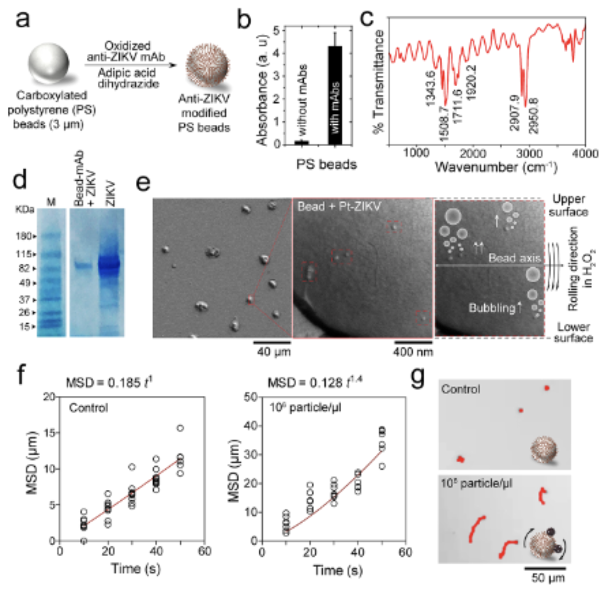
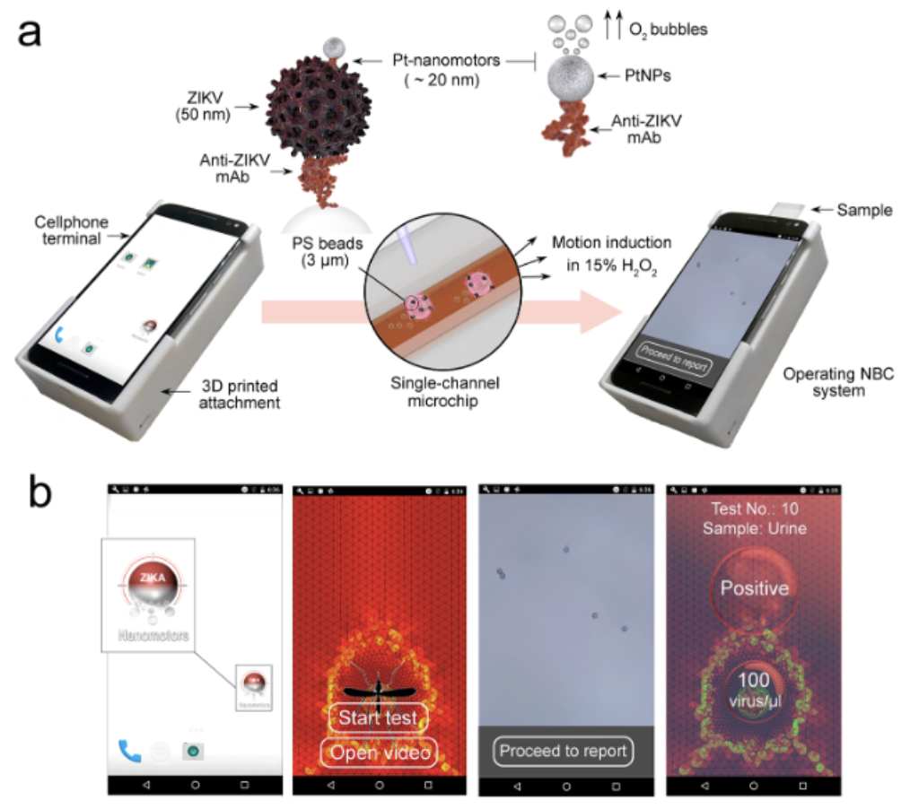
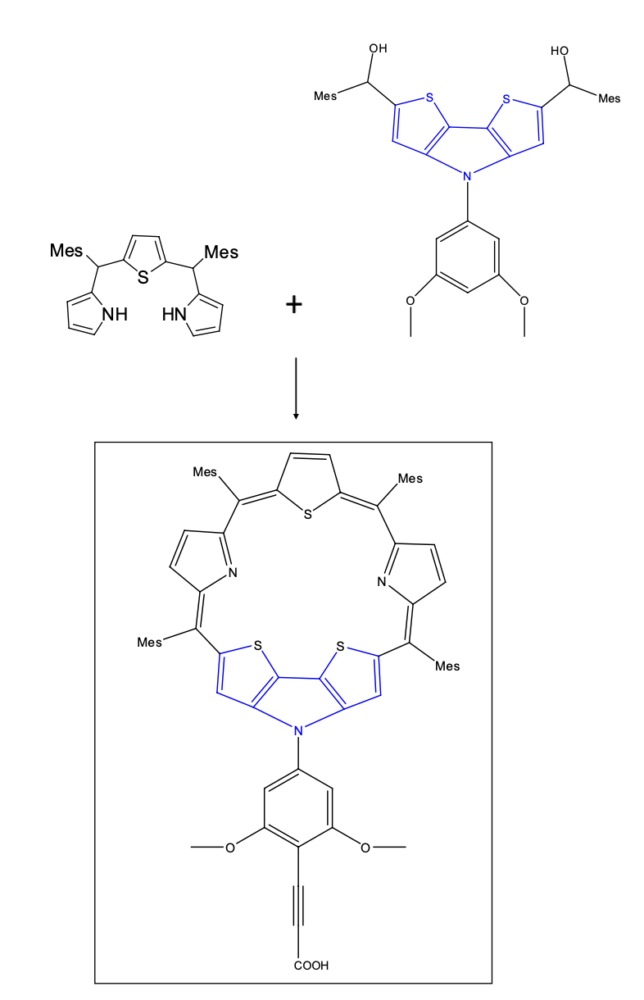
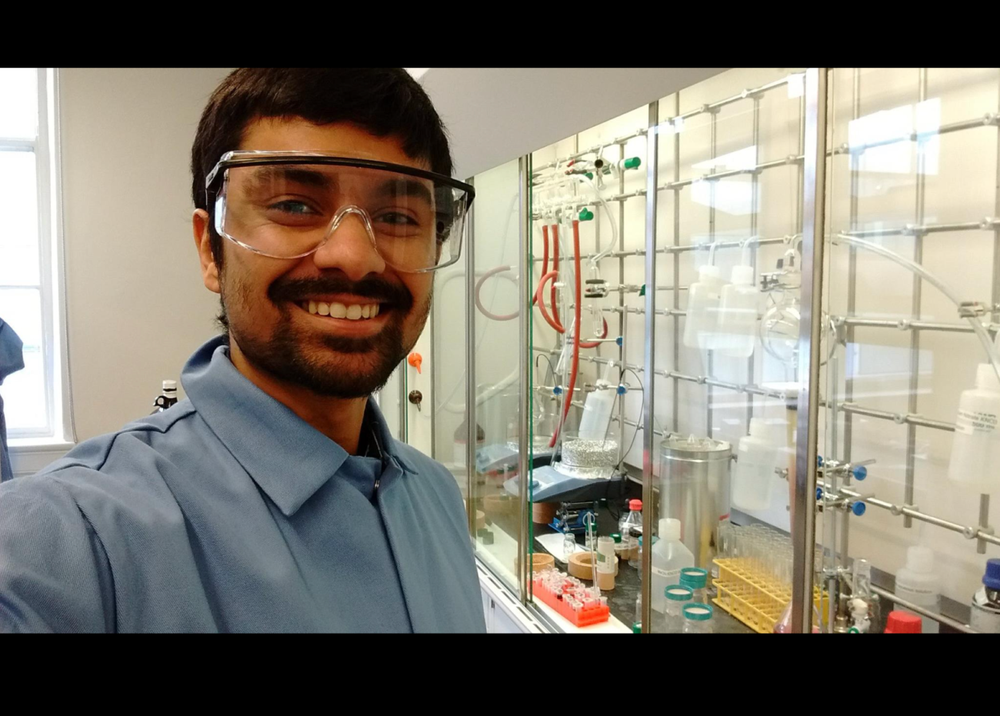

<b><i>Research portfolio</i></b>

## 1. Background
### 1.1 About me
Hello! It's nice to meet you. Thanks for taking the time to be here! 
My name is Shantanu Kallakuri. I am a recent graduate of <b>[Cornell University](https://en.wikipedia.org/wiki/Cornell_University)</b> and previously <b>[BITS Pilani](https://en.wikipedia.org/wiki/BITS_Pilani)</b>, currently working on design and fabrication of semiconductors for energy, optics, and electronics. I’m presently a Senior Process Engineer at <b>[Applied Materials](https://en.wikipedia.org/wiki/Applied_Materials)</b>, Santa Clara, working on advancing Plasma-enhanced Atomic Layer Deposition <b>[(PE-ALD)](https://en.wikipedia.org/wiki/Atomic_layer_deposition)</b> for next-generation <b>[semiconductor nodes](https://en.wikipedia.org/wiki/List_of_semiconductor_scale_examples)</b> and <b>[emergent transistor devices](https://en.wikipedia.org/wiki/Multigate_device)</b> - the tiny little switches that form the foundation of all modern electronics today. For more details on my research work please refer to my <a href="https://drive.google.com/file/d/1umNn67CTIcMS_8NByHUX81RO8HjEb8CM/view?usp=sharing" title="Research Portfolio" target="_blank"><b>CV</b></a>, <b>[publications](https://scholar.google.com/citations?hl=en&user=sQuyU90AAAAJ)</b>, <b>[patents](https://patents.google.com/?inventor=shantanu+kallakuri&oq=shantanu+kallakuri)</b>, and <b>[book chapter](https://www.appleacademicpress.com/functionalized-engineering-materials-and-their-applications-/9781771885232)</b>.
  

## 2. Influences

### 2.1 Governing Principles
My research is deeply influenced by my personal values and interests. I am passionate about protecting the planet and seek to leverage my knowledge, experience, and resources to develop systems that positively impact society. Central to my approach are the principles of energy efficiency, waste reduction, and sustainability — values that I have imbibed and embraced through various life influences. These principles have driven me to explore fields where I can apply my love for Chemistry, Physics, and Materials Science, particularly in synthesis and molecular design. Consequently, I am a strong proponent for scalable systems that minimize energy consumption and maximize utility. Achieving these objectives though necessitates integrating multidisciplinary science and engineering to create comprehensive end-to-end material cycles so we can avoid something as insidious as polythene. With this framework in mind, I plan to pursue my interests and research goals coherent with the following ideas below.  

### 2.2 Applications
Applications and areas of research that I have been involved in for the most part have been: 
1) Energy-efficient electronic / optic / photonic devices 
2) Self-assembled fibers & thin-films with exotic properties like symmetry / chirality / magnetism 
3) Self-assembled fibers to remedy heavy-metals like Arsenic and Lead from groundwater 
4) Nanomotors for inexpensive point-of-care viral diagnostic microfluidic chips in developing nations & 
5) Dye sensitized solar cells and electron donor-acceptor systems
  

## 3. Design Principles
### 3.1 Scalable bottom-up systems
One of my fundamental interests and a lot of my past work lie in <b>[bottom-up](https://en.wikipedia.org/wiki/Nanomaterials#Bottom-up_methods)</b> materials chemistry approaches to help design and build <b>[functional materials](https://www.sciencedirect.com/topics/materials-science/functional-material)</b> starting from individual entities like <b>[atoms](https://en.wikipedia.org/wiki/Atom)</b> / <b>[quantum-dots](https://en.wikipedia.org/wiki/Quantum_dot)</b> / <b>[nanocrystals](https://en.wikipedia.org/wiki/Nanocrystalline_material)</b> / <b>[small molecules](https://doi.org/10.1021/acs.chemrev.2c00844)</b> / <b>[macro molecules](https://en.wikipedia.org/wiki/Macromolecule#Synthetic_macromolecules)</b> using methods that require minimal intervention i.e. <b>[molecular self-assembly](https://en.wikipedia.org/wiki/Molecular_self-assembly)</b> / <b>[directed self-assembly](https://en.wikipedia.org/wiki/Directed_assembly_of_micro-_and_nano-structures)</b> / <b>[amphiphilic self-assembly](https://pubs.acs.org/doi/10.1021/ar200226d)</b> / <b>[atomic layer deposition](https://en.wikipedia.org/wiki/Atomic_layer_deposition)</b> / <b>[chemical vapor deposition](https://en.wikipedia.org/wiki/Plasma-enhanced_chemical_vapor_deposition)</b> / <b>[click-chemistry](https://en.wikipedia.org/wiki/Click_chemistry)</b>. As most of these routes given the right conditions can be self-directed and spontaneous; atoms & molecules can be coerced to spontaneously assemble into anything we want them to given the right conditions, only limited by our imagination. This ability to build, construct, and utilize materials is something I find very fascinating and boundless.
  

### 3.2 Programmable matter
Another closely related passion of mine is the ability to <b>[program matter](https://en.wikipedia.org/wiki/Programmable_matter)</b> - by utilizing artificial atoms such as <b>[nanoparticles](https://onlinelibrary.wiley.com/doi/10.1002/adma.202107875)</b> and quantum dots or individual atoms and molecules. This involves engineering molecules to create building blocks that <b>[interact with](https://pubs.acs.org/doi/full/10.1021/acs.jpcc.4c02012)</b>, <b>[correlate with](https://pubs.acs.org/doi/abs/10.1021/acs.chemmater.6b00623)</b>, or <b>[integrate into other structures](https://www.nature.com/articles/nmat4576)</b> for specific purposes. Examples include <b>[superlattices](https://pubs.aip.org/avs/jva/article-abstract/30/3/030802/244536/Colloidal-nanocrystal-quantum-dot-assemblies-as)</b>, block copolymers, <b>[coupled quantum-dots](https://pubs.acs.org/doi/abs/10.1021/acs.jpclett.7b00846)</b>, artifical atoms, polymer brushes, and <b>[programmable atom-equivalents](https://mirkin-group.northwestern.edu/project/programmable-nanomaterials/#:~:text=Unlike%20atomic%20systems%20in%20which,from%20the%20oligonucleotide%20%E2%80%9Cbonds%E2%80%9D%20)</b>. The natural ability of systems like <b>[natural photonic structures](https://www.nature.com/articles/nature01941)</b> and <b>[DNA](https://bio.libretexts.org/Courses/Portland_Community_College/Cascade_Microbiology/22%3A_Appendix_B_-_Molecular_Genetics_Review/22.2%3A_Structure_and_Function_of_DNA)</b>, where the <b>[nucleotides](https://en.wikipedia.org/wiki/Nucleotide)</b> are built and operate in such a specific and countably limited manner but still generate stochastic process and an unlimited number of larger hierarchical structures never ceases to amaze me in this respect.
  

### 3.3 Lowering consumption
The biggest problem we face today is rampant and uncontrolled <b>[consumption patterns](https://www.theworldcounts.com/challenges/climate-change/energy/global-energy-consumption)</b> and demographically disparate resource availability exacerbated by population explosion. These cycles are only bound to snowball as population grows exponentially with <b>[no sustainable](https://ourworldindata.org/waste-management)</b> and quick way to reuse or recycle them. A good way to control this is to bring about awareness and education but given the time needed, massive number of people, complex geopolitics, fast fashion, lower costs, and inefficient administration, there is no single authority that can implement this effectively. We will ultimately have to sidestep this by engineering the materials themselves to either degrade and/or minimize the volume and energy needed for their function.

I see 1) <b>[high-speed](https://semiwiki.com/semiconductor-manufacturers/tsmc/339578-iedm-tsmc-ongoing-research-on-a-cfet-process/)</b> and <b>[low-power computing devices & architectures](https://en.wikipedia.org/wiki/Low-power_electronics)</b>, 2) <b>[quantum automata for logic and memory computing](https://en.wikipedia.org/wiki/Quantum_cellular_automaton)</b>, 3) <b>[quantum-dot cellular automata](https://en.wikipedia.org/wiki/Quantum_dot_cellular_automaton)</b>, 4) <b>[spintronic devices](https://www.sciencedirect.com/science/article/pii/S0304885320302353)</b> and 5) <b>[photonic devices](https://en.wikipedia.org/wiki/Photonic_integrated_circuit)</b> as the main avenues that can bring about this change. Reasons for this interest are multifold - these approaches massively amplify and enhance properties of those very individual entities in systematic low-entropy routes with high surface / volume ratios as opposed to bulk materials which have large disorder at the microscale and lower surface / volume ratios. This consequently increases the efficiency, efficacy, and scalability of these properties and makes it possible to harness exotic quantum properties (Like size-quantization, superconductivity, and variable refractive index).
  

### 3.4 Scalability + Application
Scalability is one aspect very important to me - primarily because it would be the best way forward for humanity if people could utilize what we build in a productive and sustainable manner. I hope to use everything I've learnt so far in a way that everyone can use it and apply it to better their lives. This need to make things scalable ties in very strongly into how we engineer materials at zero-level. This plays into my choice of projects a lot and I tend to go for or design systems from scratch that I can build or modify to be scalable and manufacturable.
  

<!--- 
<html>
   <head>
      <title>HTML Video embed</title>
   </head>
   <body>
      
Self-assembly of a coarse-grained lipid chain modelled on the magic-sized cluster

       
      <iframe width="480" height="350" src="../assets/video/self-assembly.mp4" frameborder="0" allowfullscreen></iframe>
      </iframe>
   </body>
</html>
-->

## 4. Details of past work
### 4.1 Research @ Cornell

My interests have led to the pursuit of an MS with <b>[thesis](https://ecommons.cornell.edu/items/81a31052-98cf-4e4b-986f-2acdd53f106e)</b> at Cornell advised by Prof. Richard Robinson & Prof. Tobias Hanrath where I developed <b>[‘Multiscale hierarchical structures from nanocluster mesophases'](https://www.nature.com/articles/s41563-022-01223-3.epdf?sharing_token=qK0xSPviChGM7xcUPUU6btRgN0jAjWel9jnR3ZoTv0Mlj6L1ihnKIvTL2i9xTkHG6BafGwraN4s7XjNhzTsCkpUcjwSzj93HbnbM7HvIOFPm7m36QhXGbSzyqOPUa8uVHx-UmEPV7zgdeEQzPG_aG1Vi1ErkWx6UOTxHYr54Jic%3D)</b>. This work has been covered to great depth in our recent <b>[Nature Materials](https://www.nature.com/articles/s41563-022-01223-3)</b> paper and in some news outlets that picked up on this work (<b>[Nature Press](https://www.nature.com/articles/s41563-022-01235-z) &#124; [Cornell News](https://news.cornell.edu/stories/2022/04/nanoclusters-self-organize-centimeter-scale-hierarchical-assemblies) &#124; [Phys.org](https://phys.org/news/2022-04-nanoclusters-self-organize-centimeter-scale-hierarchical.html) &#124; [Eurekalert](https://www.eurekalert.org/news-releases/950527) &#124; [Technology.org](https://www.technology.org/2022/04/17/nanoclusters-self-organize-hierarchy/) &#124; [Newswise](https://www.newswise.com/articles/nanoclusters-self-organize-into-centimeter-scale-hierarchical-assemblies) &#124; [Science News](https://sciencenewsnet.in/nanoclusters-self-organize-into-centimeter-scale-hierarchical-assemblies/) &#124; [Nanowerk](https://www.nanowerk.com/nanotechnology-news2/newsid=60396.php) &#124; [Science Springs](https://sciencesprings.wordpress.com/2022/04/14/from-the-cornell-chronicle-nanoclusters-self-organize-into-centimeter-scale-hierarchical-assemblies/) &#124; [NanoTech Now](https://www.nanotech-now.com/news.cgi?story_id=57033)</b>). Super excited to see where this work leads!
 

<b><u> 
Hierarchy of self-assembly of our magic-sized cluster quantum-dot system.</u><i> Images reprinted with permission from article journal and original authors. Citation: Nature Materials, 21(5): 518-525 (2022) : "Multiscale hierarchical structures from a nanocluster mesophase" H. Han, S. Kallakuri, Y. Yao, C. B. Williamson, D. R. Nevers, B. H. Savitzky, R. S. Skye, M. Xu, O. Voznyy, J. Dshemuchadse, L. F. Kourkoutis, S. J. Weinstein, T. Hanrath, R. D. Robinson</i></b>

My thesis aimed to answer the following question: how can we replicate the intricate self-assembly seen in nature, like DNA or butterfly wings, and what building blocks can we use to achieve this? While self-assembly is well-known, creating a macroscale structure from the atomic level has been a long-standing challenge, especially across the 7 orders of magnitude (nano to centi) that we achieved in our work. We successfully built a system that preserves atomic properties in bulk materials without using expensive semiconductor equipment, relying instead on basic lab chemicals and beakers. This was accomplished in Prof. Richard Robinson’s lab at Cornell, together with postdoc Haixiang Han and I leading the effort.

  <iframe width="560" height = "560" src="https://1drv.ms/v/s!Ai1e8wMlG1kNhpgiOhEkIepsIBRU4A?e=yythKJ"></iframe> 

<b><u> My Final Thesis Presentation at Cornell on Hierarchical Quantum-Dot Multiscale Structures</i></b>

 

The challenge was finding a building block that could assemble across all scales (nano to bulk) without the typical disruptions caused by factors like solvent interactions, surface charges, grain boundaries, and electric fields. Bulk materials, such as keys, books, or plastic, often exhibit microcracks or disorder at some scale. If we could create a self-assembling material with perfect order across all scales, it would mean that any property of the subunit would translate to the entire bulk structure — amplified, highly ordered, and pure (>99%).

To tackle this, we used quantum dot magic-sized clusters (~1nm) as building blocks, binding them with long-tailed ligands to form a subunit (our "lego block"). The properties of the ligand's tail (stickiness) and the rigid quantum-dot core enabled these blocks to self-assemble into wires, which then formed thicker ropes. By controlling the process in a simple one-pot method, we were able to produce large, thin films that retain the properties of the individual dots, such as optical activity and chirality, with minimal loss.
  

<!--- 
<b><i>Hierarchical self-assembly of quantum-dot nanoparticles into defect-free thin-films</i></b>
 -->
<!--- <iframe width="480" height="350" src="../assets/video/self-assembly.mp4" frameborder="0" allowfullscreen></iframe>-->

 

<b><u> 
Optical, chiroptical, isomeric, and organizational properties of our MSC thin-films.</u><i> Images reprinted with permission from article journal and original authors. Citation: Nature Materials, 21(5): 518-525 (2022) : "Multiscale hierarchical structures from a nanocluster mesophase" H. Han, S. Kallakuri, Y. Yao, C. B. Williamson, D. R. Nevers, B. H. Savitzky, R. S. Skye, M. Xu, O. Voznyy, J. Dshemuchadse, L. F. Kourkoutis, S. J. Weinstein, T. Hanrath, R. D. Robinson</i></b>
 

<!--- <iframe width="480" height="350" src="../assets/video/self-assembly.mp4" frameborder="0" allowfullscreen></iframe>-->
<video width="580" height="450" controls allowfullscreen poster="../assets/images/pictures/SA.png">
  <source src="../assets/video/self-assembly.mp4" type="video/mp4" />
</video>

<b><u> 
Some simulations I had done on LAMPPS & Python to understand the ordering of our QD magic-sized clusters.</u><i> Video used with permission from article journal and original authors. Citation: Nature Materials, 21(5): 518-525 (2022) : "Multiscale hierarchical structures from a nanocluster mesophase" H. Han, S. Kallakuri, Y. Yao, C. B. Williamson, D. R. Nevers, B. H. Savitzky, R. S. Skye, M. Xu, O. Voznyy, J. Dshemuchadse, L. F. Kourkoutis, S. J. Weinstein, T. Hanrath, R. D. Robinson</i></b>
 

### 4.2 Work @ MIT-DMSE
Designed and synthesized head-groups for the synthesis of self-assembling aramid amphiphiles to extract heavy-metals from groundwater. This work was accepted for the MRS Fall Meet, 2017, Boston, MA (Later withdrawn by self for patent filing reasons). The molecules designed and synthesized here served as the initial prototypes for future work continued in the following paper in <b>[Nature Nanotechnology: DOI - 10.1038/s41565-020-00840-w](https://doi.org/10.1038/s41565-020-00840-w)</b>  

### 4.3 Work @ HMS-BWH
Designed & synthesized a catalytic Janus Pt/Au nanomotor system for cheap HIV/Zika microfluidic diagnostics. Used Thiol chemistry, Polymerase Chain Reaction (PCR), Loop-mediated isothermal DNA amplification (L.A.M.P.), & particle velocimetry. The microchip is 99% accurate and has been published in ACS nano and Nature communications.

<b> 
<u>Cellphone based point-of-care diagnostics using viral velocimetric techniques coupled with DNA amplification and virus-nanomotor coupling.</u><i> 1) Images reprinted with permission from article journal and original authors. Citation: ACS Nano, 12(6): 5709-5718 (2018) : "Motion-based immunological detection of Zika Virus using Pt-nanomotors and a cellphone" M. S. Draz, N. K. Lakshminaraasimulu, S. Krishnakumar, D. Battalapalli, A. Vasan, M. K. Kanakasabapathy, A. Sreeram, S. Kallakuri, P. Thirumalaraju, Y. Li, S. Hua, X. G. Yu, D. R. Kuritzkes, H. Shafiee</i></b>

<b><u>Catalytic Janus nanomotors for velocimetric diagnosis of HIV/Zika attached nanomotors vs unattached ones.</u><i> 2) Images reprinted with permission from article journal and original authors. Citation: Nature Communications, 9(1): 4282 (2018) : "DNA-engineered micromotors powered by metal nanoparticles for motion-based cellphone diagnostics" M. S. Draz, K. M. Kochehbyoki, A. Vasan, D. Battalapalli, A. Sreeram, M. K. Kanakasabapathy, S. Kallakuri, A. Tsibris, D. R. Kuritzkes, H. Shafiee</i></b>
 

### 4.4 Work @ CSIR-IICT
Bi-conjugated aromatic Porphyrin and Sapphyrin macro-cycles for Dye-sensitized solar cells - Designed and synthesized a donor-acceptor moiety designed for harnessing solar energy and transmitting it through a dithienopyrrole acceptor followed by a synthetic bond (alkene) to a nanocrystalling scaffold for use in Dye-sensitized solar cells. The entire moiety was an expanded Porphyrin moietry called Sapphyrin that utilized the alkene bond as a wire to conduct the harnessed photoelectrons to the scaffold.

<b><u> Novel Sapphyrin-Dithienopyrrole based photosensitizer for dye-sensitized solar cells</u><i> 1) Images reprinted with permission from article journal and original authors. Citation: Thesis: Kallakuri. S, "Expanded Porphyrin - Dithienopyrrole based efficient dye sensitized solar cells - design, synthesis and fabrication"</i></b>

 

### 4.5 UG Work @ BITS-Pilani
Design and synthesis of templated Polyanilines - A new class of conductive polymeric materials.
 

<!---

    

<li class="mainmenu-line">  <a href="Guide_to_Metallurgy" title="Guide to Metallurgy"><b>Metallurgy</b></a> </li>

# Chemystery
# Covid Relief Resources
# Gallery
# Upcoming
# List of reagents
# Semiconductor Basics
# List of python commands
# Simple Python & VBA exercises
## What is this?
## Vankay Puls
### SubSubLevel-->